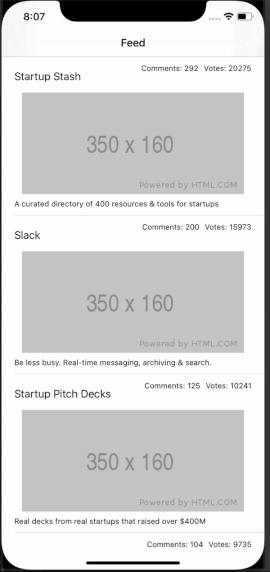

# MOB1.3 Product Hunt
Mobile 1.3 tutorial on retrieving and using data from the Product Hunt API.

## About
The purpose of this tutorial is to learn about building a network layer in Swift, decoding JSON into Swift models, and displaying data retrieved from API in UITableViews. The API used in this app is from [Product Hunt](https://api.producthunt.com/v1/docs)

### Features
* Home Screen - displays the list of Product Hunt posts as UITableView
* Comment Screen - displays all comments of a selected post as UITableView

### App Walk-through

### Run Locally
Project code can be viewed locally  and run on Xcode's simulator by downloading/cloning this repo.

## Built With
* [Xcode - 11.3.1](https://developer.apple.com/xcode/) - The IDE used
* [Swift - 5.1.4](https://developer.apple.com/swift/) - Programming Language

